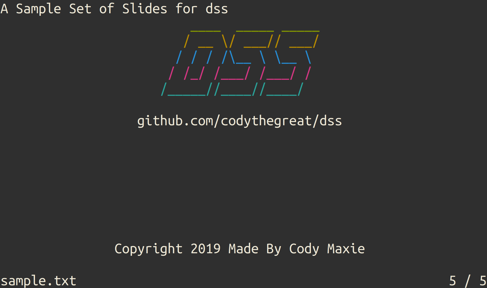

# DSS - Dead Simple Slides

Dead Simple Slides (DSS) is a text/terminal based slide presentation tool that reads .txt files for formatted slides. These slides are then displayed to the terminal.

DSS's main goal is to simply display a slide back exactly as it is formatted in the .txt. This gives you the ultimate power of customizability. For use cases such as ASCII art this is preferrable to programs that have reserved symbols.

### Features

DSS is in the very early stages of development. We still have a lot of features to add, but so far we've added the following:
+ parsing of slides from a .txt file, slide centering, and bottom bar with slide counter
+ navigation with `j`/`k`
+ quiting with `q`
+ jumping to first/last slide with `g`/`G`
+ jumping to a slide by number with `7G`
+ bookmarking slides (up to 5 bookmarks currently) with `b`
+ jumping to a bookmark with `B` and the key of the register
+ switching color themes with `t` (currently there are 4 themes, but more are planned to be added)
+ Vim style command mode `:` for jumping to slides `:3`, quitting `:q`, bookmark handling `:bmark/blist/bclear`, and opening of new files `:open filename`.

### Planned Features

A few features that are planned include:
+ greater color formatting options
+ url detection and selection with H/L
+ markdown style text parsing (optional, enabled by flag)
+ quick fade animations (quick as in non-intrusive when rapidly switching through slides)
+ searching (search will find first instance of search criteria on a prior/following slide)

### Installation

cd into the directory and run the following command:

`gcc -I ./include src/main.c -o dss -lncurses`

or simply run the Makefile:

`make install`

### Usage

With the latest version of DSS you can simply run the program with a text file argument:

`./dss sample.txt`

Note that you will need to include `title` and `slides` variables inside your txt file. See the sample files for more details. 

Slides start after the `{STARTSLIDES}` tag, and the program iterates to the next slide when it sees the `{ENDSLIDE}`.

### Limitations

DSS doesn't center UTF-8 characters properly. Slides with UTF-8 characters should display fine, but they may be off center.

I'm working on a solution for this issue.

### Contributing

Contribution to the project is welcome and encouraged. If you'd like to contribute please follow these guidelines:
1. Check out the issues page. I've added a few issues with helpful hints that might be a good place to start.
2. If you are working on an issue, comment on the issue and reference it when making a merge request.
3. If you can provide test resources for your fix/feature please do.
